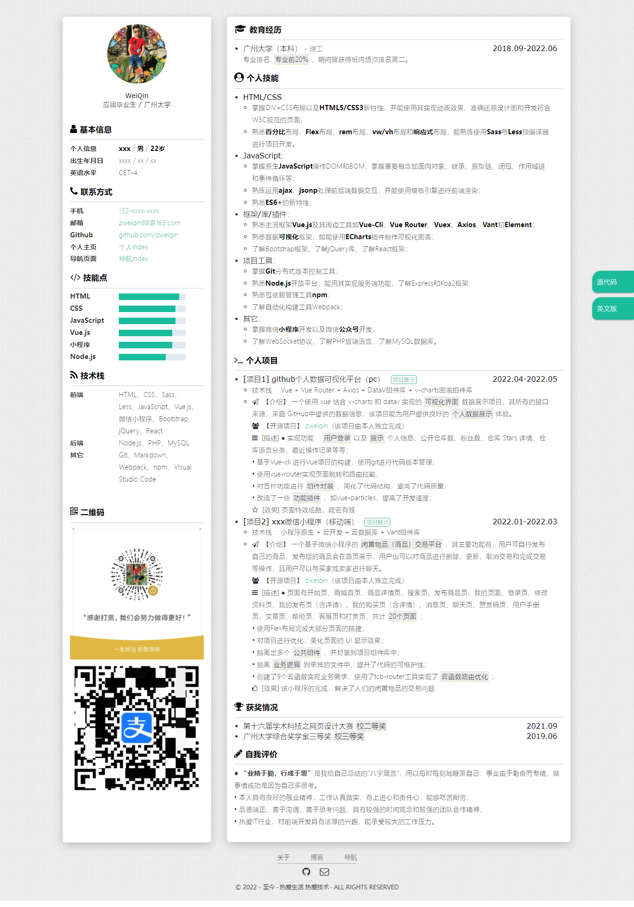

# 个人简历模板

[https://github.com/zweiqin](https://github.com/zweiqin)

预览：[https://github.com/zweiqin](https://github.com/zweiqin)

## Intro

此简历模板：

- 内容上，来源于我本人参考大多数求职文档以及参考各大大厂招聘要求总结而成；
- 风格上，参考众多简历风格。

欢迎提 issue 或者 star，ღ( ´･ᴗ･` )比心

## Object

前端求职/程序员求职

## Usage

1. 先 Star/Fork 本项目，然后 Clone 或者直接下载到本地；
2. 修改 index.html 内相关信息；
3. 微调样式；
4. 部署到线上；
5. 祝您求职成功！
6. 生成 pdf（开发中)
7. 生成访问二维码（开发中）

## Preview

### PC 端

### 移动端

## TODO

- [ ] 输出 pdf 功能
- [ ] 可编辑

## Acknowledgments

- font-awesome 提供字体图标

## At Last

最后的最后如果喜欢的话不妨给个小小的 Star ， 支持一下开发者！！🎃
